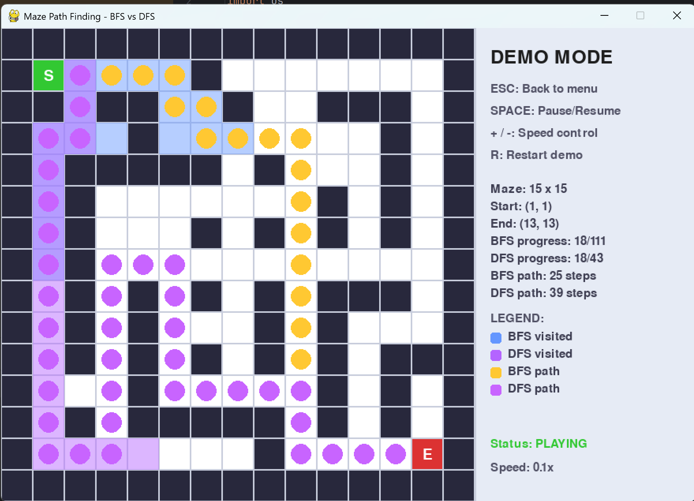
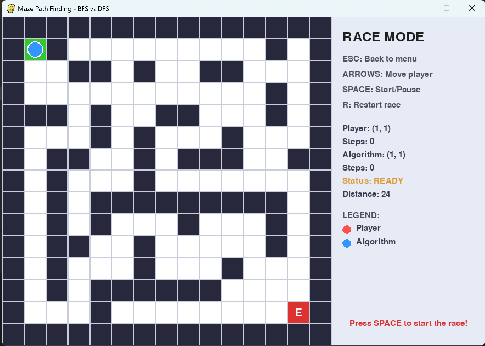

# 🎮 迷宫寻路算法可视化系统

<div align="center">


**一个直观展示BFS与DFS算法的交互式可视化工具**

[✨ 特性](#特性) | [🚀 快速开始](#快速开始) | [🎮 使用指南](#使用指南) | [📊 算法对比](#算法对比) | [📁 项目结构](#项目结构)

</div>

## ✨ 特性

### 🎨 双模式设计
- **演示模式**：直观对比BFS和DFS算法的搜索过程
- **比赛模式**：玩家与算法对战，增强学习趣味性

### 📊 算法可视化
- **实时动画**：展示算法探索迷宫的过程
- **彩色编码**：不同颜色区分BFS和DFS的探索区域和路径
- **性能统计**：显示步数、探索节点数等关键指标

### 🎮 交互体验
- **键盘控制**：方向键移动玩家，快捷键控制程序
- **动态调整**：实时调整演示速度
- **即时反馈**：清晰的视觉和文字反馈

### ⚙️ 技术特点
- **模块化设计**：清晰分离算法、界面和逻辑
- **可扩展架构**：易于添加新算法
- **跨平台运行**：支持Windows、macOS、Linux

## 🎥 演示

<!-- 这里可以放GIF或图片 -->
<div align="center">

### 演示模式


### 比赛模式

ps：这里还没有开始比赛


</div>


# 📦 安装与运行指南

## 环境要求
| 项目 | 要求 | 备注 |
|------|------|------|
| **操作系统** | Windows 10/11, macOS 10.15+, Ubuntu 18.04+ | 跨平台支持 |
| **Python版本** | Python 3.7 或更高版本 | [下载Python](https://www.python.org/downloads/) |
| **内存** | 至少 2GB 可用内存 | 推荐4GB以上 |
| **屏幕分辨率** | 1024×768 或更高 | 最佳显示效果 |

## 📥 安装步骤

### 方法一：一键安装（推荐）
1. **下载项目**到你的电脑
2. **打开命令行**，进入项目目录
3. **安装依赖包**
   ```bash
   pip install pygame
  国内用户可以使用镜像加速：
   ```bash
       pip install pygame -i https://pypi.tuna.tsinghua.edu.cn/simple
   ```
### 方法二：使用requirements.txt
```bash
    pip install -r requirements.txt
```
### 方法三：创建虚拟环境（可选）
```bash
# 创建虚拟环境
python -m venv venv

# 激活虚拟环境
# Windows:
venv\Scripts\activate
# macOS/Linux:
source venv/bin/activate

# 安装依赖
pip install pygame
```
## 运行程序
标准运行方法：
```bash
   python main.py
```


